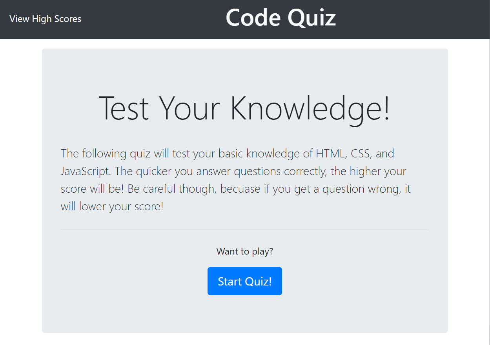

# Code Quiz

## Description
This application is a quick quiz designed to evaluate your basic knowledge of HTML, CSS, and JavaScript. The Code Quiz takes little over a minute to complete and scores performace based on time remaining. Be careful though! Any wrong answer removes 15 seconds from the timer.

## How it Works
When the user arrives at the landing page, they are invited to take the quiz. The instructions for play and scoring parameters are outlined on this page. Once the user clicks the "Start Quiz" button, the game begins!

The user is then prompted to complete 5 multiple choice questions about web development. Clicking on an answer advances the user to the next question. When the final question is answered (or when the timer runs out), the quiz is over.

Finaly, the user is shown their score and asked to enter their initials and click the "Submit" button in order to save their score to the leaderboard!

## Under the Hood
Below are two code snippets that demonstrate different aspects of the application's inner workings.

### code snippet 1

    choicesDisplay.addEventListener("click", function (event) {
      if (event.target.matches("button")) {
        userAnswer = event.target.textContent;
          if(userAnswer !== questions[currentQuestion].answer) {
            wrongAnswer();
          } 
          else if (userAnswer === questions[currentQuestion].answer) {
            rightAnswer();
          };

          if (currentQuestion < 4) {
            currentQuestion++
            pullQuestion();
          } else {
            endGame();
          };
        };
      });

This segment of code serves to display questions, one after the other, after the quiz begins. Using event listeners, the application checks to see if what the user clicked on was one of the buttons displaying the possible answers. If true, the code then checks if the answer was correct or incorrect by comparing it to the answer key of each question component in our linked question object. A correct answer initiates the rightAnswer function, displaying that the user's choice was correct, while an incorrect answer displays the opposite message, while also removing 15 seconds from the timer.

If we have reached the end of the quiz (currentQuestion > 5), the game ends, and the user is prompted to log their score and initials. Otherwise, we initiate the pullQuestion function, shown in greater detail below.

### code snippet 2

    function pullQuestion() {
      questionsDisplay.textContent = "";
        questionsDisplay.textContent = questions[currentQuestion].title;
          firstQ.textContent = questions[currentQuestion].choices[0];
          secondQ.textContent = questions[currentQuestion].choices[1];
          thirdQ.textContent = questions[currentQuestion].choices[2];
          fourthQ.textContent = questions[currentQuestion].choices[3];
    };

The pullQuestion function does the work of pulling the question information from our "questions" object in the linked JavaScript to the DOM. The question appears in the questionDisplay by referencing the title key of the object element. Similarly, each of the choices are pulled from the corresponding array of strings and are displayed as buttons. 

## The App In Action!

### screenshot 1
In the upper right-hand corner of the screen we have the quiz timer. This timer starts with 75 seconds and counts down until the quiz is complete or time runs out. This display is updated continuously as the quiz is being taken.

At the bottom, we see "CORRECT!" displayed across the footer, indicating that the user responded correctly to the previous question.

### screenshot 2
Alternatively, in this screenshot we do not see the timer in the upper right-hand corner. Until the quiz is started, this element, as well as the rest of the quiz area, is hidden via the boostrap component class, "d-none".

This screen, on the otherhand, becomes hidden upon the click of the "Start Quiz" button.

## Deployed Link
Below is a link to the live application!
* [See Live Site](https://ietoy.github.io/HW4-Code-Quiz/) 

## Authors
Ian Toy

## Acknowledgements
Special thanks to my instructor Jerome, our teaching assistants Kerwin and Mahisha, and my classmates Yali, Chris, Rachel, Ken, and Andres for their help in making this application possible!

